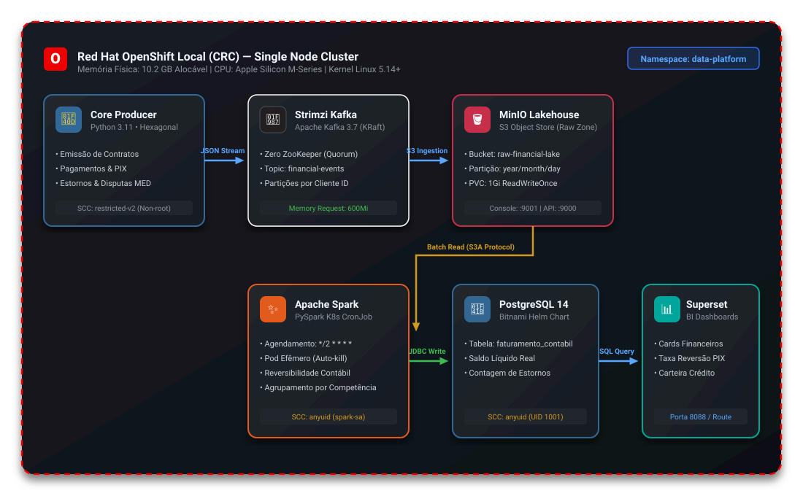
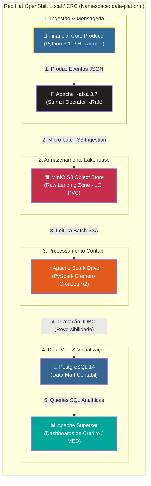

# OpenShift Lean Data Platform

Uma plataforma de dados bancária e analítica de ponta a ponta, nativa em contêineres e orientada a eventos, projetada para operar no limite de recursos de um ambiente **Red Hat OpenShift Local (CRC)** em Apple Silicon (16GB RAM).

---

## 🏗️ 1. Arquitetura de Dados Oficial

O diagrama abaixo ilustra a jornada completa do dado desde a geração do evento transacional no Core Banking até a camada analítica de apresentação no Superset, operando sob o isolamento de segurança e restrição de recursos do cluster.



> **Arquivo Editável:** O diagrama com todas as conexões, metadados e camadas está disponível no padrão Draw.io em [`docs/architecture/architecture.drawio`](docs/architecture/architecture.drawio).

### Diagrama de Fluxo e Componentes (Mermaid)



---

## ⚙️ 2. Como Funciona o OpenShift e o Kubernetes?

O **Kubernetes (K8s)** é o motor de orquestração padrão da indústria:
- Ele gerencia o ciclo de vida dos contêineres (**Pods**), agendamento nos nós do cluster, balanceamento de rede (**Services**), pontos de persistência (**PersistentVolumeClaims**) e tarefas agendadas (**CronJobs**).

O **Red Hat OpenShift** é uma distribuição empresarial construída **em cima** do Kubernetes, adicionando camadas fundamentais de governança corporativa:
1. **Security Context Constraints (SCC):** Diferente do Kubernetes padrão que roda contêineres como root se não houver restrição, o OpenShift bloqueia UIDs fixos e execução root por padrão através da SCC `restricted-v2`. Imagens tradicionais (como Bitnami PostgreSQL com UID 1001 ou Spark driver) necessitam da SCC `anyuid` atribuída à sua respectiva `ServiceAccount`.
2. **Operators (OLM):** O OpenShift utiliza operadores nativos para orquestrar serviços complexos. O Kafka nesta plataforma é gerenciado pelo operador corporativo **Strimzi**, que abstrai nós, listeners e tópicos através de Custom Resource Definitions (CRDs).
3. **Ingress e Routes:** Em vez de depender apenas de Ingress controllers genéricos, o OpenShift fornece recursos nativos de `Route` com terminação TLS automática integrada ao roteador HAProxy do cluster.

---

## 💻 3. Como o OpenShift Roda Localmente (CRC)

O **OpenShift Local (CodeReady Containers - CRC)** provisiona uma máquina virtual Linux minimalista (via Hypervisor macOS) rodando um nó único (*All-in-One: Master + Worker*) com o Red Hat Enterprise Linux CoreOS (RHCOS).

### O Desafio de Memória em 16GB RAM:
O nó do CRC disponibiliza aproximadamente **10.2 GB de memória alocável**. O próprio Control Plane do OpenShift (ETCD, API Server, DNS, Ingress, CVO) consome quase 100% dessa capacidade se deixado na configuração padrão.

Para viabilizar a plataforma de dados, aplicamos a estratégia de **"Orçamento Cirúrgico de Recursos"**:
- **Desativação de Operadores Pesados:** Escalonamos para zero o `cluster-version-operator`, operadores de monitoramento do cluster (`openshift-monitoring`), catálogo e registry interno.
- **Pods Efêmeros:** Em vez de manter um cluster Spark dedicado consumindo memória continuamente, o processamento ocorre via **Kubernetes CronJob**. O Pod do PySpark sobe, processa os dados da janela de tempo, grava no Postgres e morre, devolvendo a memória imediatamente ao cluster.
- **Kafka KRaft:** Eliminamos o Apache ZooKeeper, reduzindo o consumo de memória do Kafka para apenas 600MiB.

---

## 🧩 4. Arquitetura de Software dos Componentes

O projeto segue os princípios **SOLID** e a **Arquitetura Hexagonal (Ports and Adapters)**:

### 🐍 `producer/` (Core Banking Producer)
Simula os fluxos de um banco digital moderno emitindo eventos financeiros no formato JSON:
- **`domain/`**: Entidades puras (`FinancialEvent`) e geradores de regras de negócio (Contratos, Empréstimos, Pagamentos, PIX, Estornos e Disputas do Mecanismo Especial de Devolução - MED).
- **`application/`**: Casos de uso (`ProduceEventsUseCase`) e portas de saída abstratas (`MessagePublisher`).
- **`infrastructure/`**: Adaptador concreto para mensageria (`KafkaMessagePublisher`) injetado via porta.

### ✨ `analytics/` (PySpark Accounting Engine)
Motor analítico em batch que implementa a **Reversibilidade Contábil**:
- Normaliza tipos de eventos conflitantes (pagamentos vs estornos).
- Eventos de contestação ou devolução entram com valor invertido (`-col("valor")`) abatendo a receita contábil da data de competência.
- Saída agregada gravada diretamente na tabela analítica `faturamento_contabil_diario` no PostgreSQL.

---

## 🚀 5. Esteira de Integração Contínua (CI Granular)

O repositório possui uma esteira **DAG Ultra Granular** no GitHub Actions, organizada em Jornadas:

```
[ Push / PR ]
      ├── 🛡️ Jornada de Qualidade (Paralelo)
      │     ├── 🎨 Format (Black, Isort)
      │     ├── 🔍 Lint (Flake8)
      │     ├── 🛡️ SAST (Bandit -s B311, Safety)
      │     └── 🏷️ Type Check (Mypy)
      │     └── 🚥 GATE: Quality Passed
      │
      ├── 🧪 Jornada de Testes (Paralelo)
      │     ├── 🧪 Testes Unitários + Cobertura (Pytest-cov)
      │     ├── 🔗 Testes de Integração (Postgres / Kafka Local Stack)
      │     └── 🚥 GATE: Testing Passed
      │
      └── 🚀 Jornada de Release (Condicional: Main/Release)
            ├── 🐳 Build Dockerfile (Multi-stage)
            ├── 🔥 Container Smoke Test Nativo
            └── 🚀 Push de Imagem no Registry
```

---

## 🛠️ 6. Guia Passo a Passo de Configuração

### Pré-requisitos
- Mac com Apple Silicon (M1/M2/M3/M4) e 16GB RAM.
- `crc` (OpenShift Local) e `oc` instalados.
- Helm 3.x.

### 1. Inicializar o Cluster e Configurar Contexto
```bash
./k8s/00-init-mac-crc.sh
eval $(crc oc-env)
oc project data-platform
```

### 2. Liberar Permissões de Segurança (SCC AnyUID)
```bash
oc adm policy add-scc-to-user anyuid -z default -n data-platform
oc adm policy add-scc-to-user anyuid -z superset -n data-platform
oc adm policy add-scc-to-user anyuid -z superset-postgresql -n data-platform
oc adm policy add-scc-to-user anyuid -z spark-sa -n data-platform
```

### 3. Subir Armazenamento e Mensageria
```bash
oc apply -f k8s/01-minio-lean.yaml
oc apply -f k8s/02-kafka-kraft-lean.yaml
```

### 4. Provisionar Data Mart e Superset (Helm)
```bash
./k8s/03-superset-postgresql.sh
```

### 5. Implantar o Producer e o Job Analítico
```bash
oc apply -f k8s/04-producer-deployment.yaml
oc apply -f k8s/05-spark-analytics.yaml
```

### 6. Execução Manual do Job Analítico
```bash
oc create job --from=cronjob/spark-analytics-cron spark-manual-run -n data-platform
oc logs -f job/spark-manual-run -n data-platform
```

---

## 📄 Licença
Distribuído sob licença MIT.
