# OpenShift Lean Data Platform

Uma plataforma de dados bancária e analítica de ponta a ponta, nativa em contêineres e orientada a eventos, projetada para operar no limite de recursos de um ambiente **OpenShift Local (CRC)** em Apple Silicon.

## 🏗️ Desenho de Arquitetura de Dados

Abaixo está o diagrama oficial da plataforma, modelado com componentes de mensageria, armazenamento e processamento.

```mermaid
flowchart TD
    %% Estilos (Cores imitando ícones oficiais)
    classDef python fill:#306998,stroke:#FFD43B,stroke-width:2px,color:white;
    classDef kafka fill:#231F20,stroke:#white,stroke-width:2px,color:white;
    classDef minio fill:#C72E49,stroke:#white,stroke-width:2px,color:white;
    classDef spark fill:#E25A1C,stroke:#white,stroke-width:2px,color:white;
    classDef postgres fill:#336791,stroke:#white,stroke-width:2px,color:white;
    classDef superset fill:#00A699,stroke:#white,stroke-width:2px,color:white;
    classDef k8s fill:#326CE5,stroke:#white,stroke-width:2px,color:white;

    subgraph OpenShift ["OpenShift / Kubernetes Cluster"]
        style OpenShift fill:#f4f4f4,stroke:#326CE5,stroke-width:2px,stroke-dasharray: 5 5

        Producer["🐍 Python Core Banking\n(Microservice Producer)"]:::python
        Broker["🦇 Apache Kafka (KRaft)\n(Strimzi Operator)"]:::kafka
        DataLake["🪣 MinIO S3\n(Raw Landing Zone)"]:::minio
        ETL["✨ Apache Spark\n(PySpark K8s CronJob)"]:::spark
        DW["🐘 PostgreSQL\n(Data Mart Contábil)"]:::postgres
        BI["📊 Apache Superset\n(Data Visualization)"]:::superset

        Producer -- "1. Publica Eventos Financeiros\n(JSON)" --> Broker
        Broker -- "2. Kafka Connect Sink\n(Backlog)" --> DataLake
        DataLake -- "3. Lê lotes a cada 2h\n(PySpark)" --> ETL
        ETL -- "4. Aplica regras contábeis\ne consolida (JDBC)" --> DW
        DW -- "5. Consulta Data Mart\n(SQL)" --> BI
    end
```



---

## 1. O que é o OpenShift e como ele roda aqui?

O **Red Hat OpenShift** é uma plataforma corporativa construída sobre o **Kubernetes**. O **OpenShift Local (anteriormente CodeReady Containers - CRC)** traz um cluster minimalista (Node único) que roda dentro de uma Máquina Virtual (VM) no macOS. 

A arquitetura do OpenShift por si só (Control Plane, Operadores Nativos, DNS, Ingress) consome uma quantidade massiva de recursos. Para viabilizar uma plataforma de Big Data inteira (Kafka, MinIO, Spark, PostgreSQL, Superset) nessa mesma VM, aplicamos um **"Orçamento Cirúrgico de Memória"**, reduzindo os "Requests/Limits" de CPU e RAM e suspendendo serviços nativos do OpenShift (como Monitoramento, Registry e CVO).

## 2. Visão da Plataforma e Kubernetes (K8s)

- **Armazenamento S3:** Um servidor **MinIO** rodando em um único Pod (via `Deployment`), consumindo o mínimo de memória.
- **Mensageria Event-Driven:** **Apache Kafka** em modo KRaft (sem Zookeeper) implantado e gerenciado através do operador **Strimzi**.
- **Data Mart Analítico:** Um banco **PostgreSQL** (via Helm).
- **Processamento:** Em vez de usar clusters Spark dedicados, o K8s utiliza **CronJobs**. A cada 2 horas, um contêiner efêmero sobe o PySpark, processa dados do MinIO, grava no Postgres e morre, liberando memória.

## 3. Arquitetura de Software (SOLID & Hexagonal)

O projeto está estruturado em **Arquitetura Hexagonal (Ports and Adapters)**:
- **`producer/`**: Microsserviço Python que simula um Core Bancário gerando eventos financeiros (Propostas, Pagamentos, PIX, Estornos). Isolado em `Domain`, `Application` e `Infrastructure`.
- **`analytics/`**: Job PySpark. Lida com a "Reversibilidade Contábil" (onde Estornos/MED abatem saldos positivos).

## 4. Esteira CI/CD Granular (GitFlow)

Configurado no GitHub Actions, o projeto conta com uma Árvore de Jornadas Ultra Granular:
- **Jornada de Qualidade**: `Black`, `Isort`, `Flake8`, `Bandit`, `Safety` e `Mypy` (Rodam em paralelo).
- **Jornada de Testes**: Unitários e de Integração usando `docker-compose` para subir os mocks locais de Kafka, Postgres e MinIO.
- **Jornada de Release**: Build nativo e push para Registry protegido por *Gatekeepers*.

## 5. Como Configurar e Executar

1. **Inicie o OpenShift CRC Local:**
   ```bash
   ./k8s/00-init-mac-crc.sh
   eval $(crc oc-env)
   ```

2. **Libere os Privilégios de Segurança (SCC AnyUID):**
   *(Bancos e Spark exigem permissão para rodar com UIDs estáticos no OpenShift)*
   ```bash
   oc adm policy add-scc-to-user anyuid -z default -n data-platform
   oc adm policy add-scc-to-user anyuid -z superset -n data-platform
   oc adm policy add-scc-to-user anyuid -z superset-postgresql -n data-platform
   oc adm policy add-scc-to-user anyuid -z spark-sa -n data-platform
   ```

3. **Suba a Infraestrutura e Serviços:**
   ```bash
   oc apply -f k8s/01-minio-lean.yaml -f k8s/02-kafka-kraft-lean.yaml
   ./k8s/03-superset-postgresql.sh
   oc apply -f k8s/04-producer-deployment.yaml -f k8s/05-spark-analytics.yaml
   ```

4. **Acionando o ETL Analítico Manualmente:**
   ```bash
   oc create job --from=cronjob/spark-analytics-cron spark-manual-run -n data-platform
   ```
