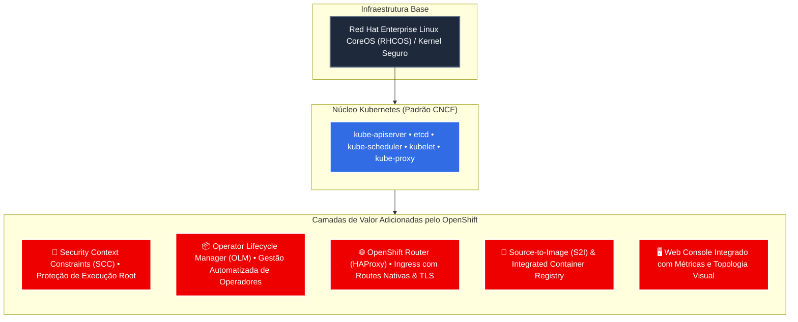
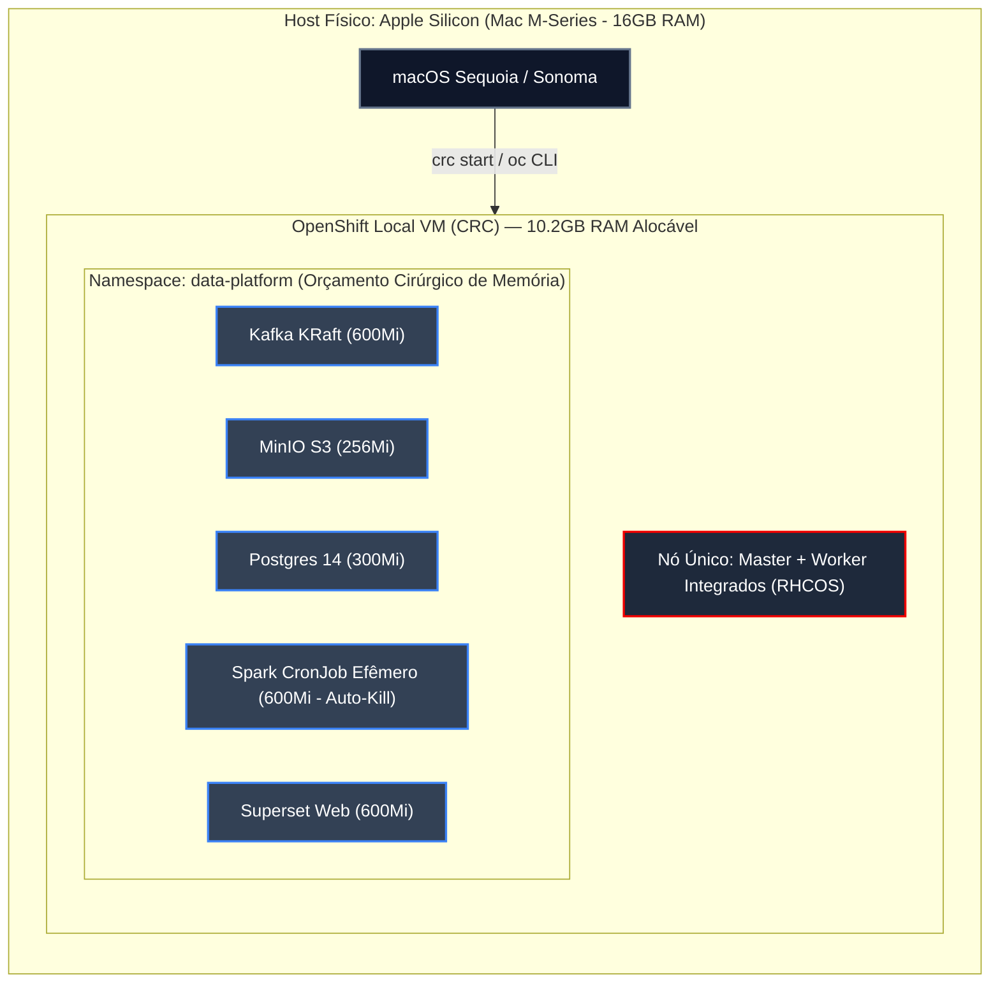

# OpenShift Lean Data Platform

Uma plataforma de dados bancária e analítica de ponta a ponta, nativa em contêineres e orientada a eventos, projetada para operar no limite de recursos de um ambiente **Red Hat OpenShift Local (CRC)** em Apple Silicon (16GB RAM).

---

## 🏗️ 1. Arquitetura de Dados Oficial

O diagrama abaixo ilustra a jornada completa do dado desde a geração do evento transacional no Core Banking até a camada analítica de apresentação no Superset, operando sob o isolamento de segurança e restrição de recursos do cluster.


> **Arquivo Editável:** O diagrama com todas as conexões, metadados e camadas está disponível no padrão Draw.io em [`docs/architecture/architecture.drawio`](docs/architecture/architecture.drawio).

### 🔀 Diagrama de Fluxo e Componentes Paralelizado (Mermaid)

Para facilitar a compreensão do paralelismo do sistema, o fluxo abaixo modela as vias simultâneas de eventos, o isolamento dos workers de processamento e a concorrência entre persistência contábil e consulta analítica:

```mermaid
flowchart LR
    classDef producer fill:#306998,stroke:#FFD43B,stroke-width:2px,color:white;
    classDef kafka fill:#231F20,stroke:#white,stroke-width:2px,color:white;
    classDef minio fill:#C72E49,stroke:#white,stroke-width:2px,color:white;
    classDef spark fill:#E25A1C,stroke:#white,stroke-width:2px,color:white;
    classDef postgres fill:#336791,stroke:#white,stroke-width:2px,color:white;
    classDef superset fill:#00A699,stroke:#white,stroke-width:2px,color:white;
    classDef boundary fill:#0F172A,stroke:#3B82F6,stroke-width:2px,stroke-dasharray: 4 4,color:white;

    subgraph CoreBanking ["🐍 Ingestão Transacional Paralela"]
        direction TB
        E1["📄 Contratos & Empréstimos"]:::producer
        E2["⚡ Transações PIX"]:::producer
        E3["💳 Pagamentos de Parcelas"]:::producer
        E4["↩️ Estornos & MED"]:::producer
    end

    subgraph KafkaStream ["🦇 Particionamento Kafka (KRaft)"]
        direction TB
        P0["Partição 0 (Clientes Hash A-G)"]:::kafka
        P1["Partição 1 (Clientes Hash H-P)"]:::kafka
        P2["Partição 2 (Clientes Hash Q-Z)"]:::kafka
    end

    subgraph StorageLake ["🪣 Lakehouse S3 (MinIO)"]
        direction TB
        B1["raw-financial-lake/year=2026/month=10/"]:::minio
    end

    subgraph SparkParallel ["✨ PySpark Executors Paralelos (CronJob)"]
        direction TB
        W1["Worker 1: Normalização de Contratos e PIX"]:::spark
        W2["Worker 2: Reversibilidade Contábil de Estornos"]:::spark
    end

    subgraph ServingDW ["🐘 Data Mart & BI"]
        direction TB
        PG[("PostgreSQL 14\nfaturamento_contabil")]:::postgres
        BI["📊 Superset Dashboards\nConsultas Analíticas"]:::superset
    end

    %% Conexões do Paralelismo de Ingestão
    E1 --> P0
    E2 --> P1
    E3 --> P2
    E4 --> P0
    E4 --> P1

    %% Conexão Kafka -> MinIO
    P0 -->|"S3 Sink Connector"| B1
    P1 -->|"S3 Sink Connector"| B1
    P2 -->|"S3 Sink Connector"| B1

    %% Leitura Paralela Spark
    B1 ==>|"Leitura Particionada S3A"| W1
    B1 ==>|"Leitura Particionada S3A"| W2

    %% Agregação e Escrita / Leitura
    W1 -->|"Consolidação JDBC"| PG
    W2 -->|"Consolidação JDBC"| PG
    PG -->|"SQL Queries"| BI
```



---

## 🏛️ 2. Guia Profundo e Didático: Kubernetes vs OpenShift

Para entender o funcionamento da plataforma neste cluster local, é essencial compreender o papel do Kubernetes e como o Red Hat OpenShift expande suas capacidades para ambientes corporativos.

### 2.1 O que é o Kubernetes (K8s)?
O **Kubernetes** é o maestro de orquestração de contêineres. Ele resolve o desafio de gerenciar aplicações distribuídas de forma declarativa:
- **Pod:** A menor unidade de execução. Pode conter um ou mais contêineres compartilhando o mesmo namespace de rede (IP e localhost) e volumes de armazenamento.
- **Deployment / ReplicaSet:** Garante que um número especificado de réplicas de um Pod esteja sempre saudável e em execução. Se um contêiner cair, o nó subir outro automaticamente (*Self-healing*).
- **Service:** Um ponto estável de rede (DNS interno e IP virtual) que balanceia requisições entre os Pods daquele serviço.
- **PersistentVolume (PV) e PVC:** Abstração de armazenamento persistente. O Pod requisita armazenamento via `PersistentVolumeClaim` (PVC), desacoplando a infraestrutura física de storage do ciclo de vida efêmero do contêiner.

### 2.2 O que é o Red Hat OpenShift?
O **Red Hat OpenShift** é uma distribuição empresarial completa do Kubernetes. Ele não substitui o Kubernetes: **ele é o Kubernetes em seu núcleo**, complementado por camadas enterprise pré-configuradas e validadas:



### 2.3 Comparativo Prático: Onde o OpenShift se Diferencia no Projeto?

| Funcionalidade | Kubernetes Vanilla | Red Hat OpenShift (Nosso Projeto) |
| :--- | :--- | :--- |
| **Segurança Padrão** | Contêiner roda como `root` se o Dockerfile declarar `USER root`. | Bloqueio automático por **SCC `restricted-v2`**. É obrigatório vincular a SCC `anyuid` para imagens como Postgres (Bitnami UID 1001) e Spark. |
| **Operadores** | Instalação manual de CRDs e controladores via manifests ou Helm. | **Operator Lifecycle Manager (OLM)** nativo. O Kafka é mantido e auto-recuperado pelo operador oficial **Strimzi**. |
| **Exposição Externa** | Exige configuração de Ingress Controllers adicionais (ex: Nginx Ingress). | Recurso nativo **`Route`** apontando para o router HAProxy, gerando URLs corporativas como `*.apps-crc.testing`. |
| **Gerenciamento de Nó** | Distribuição Linux genérica (Ubuntu, Debian, Alpine). | **Red Hat CoreOS (RHCOS)** com sistema de arquivos imutável e atualizações atomizadas. |

---

## 💻 3. Como o OpenShift Roda Localmente (CRC)

O **OpenShift Local (anteriormente CodeReady Containers - CRC)** roda um cluster OpenShift completo de nó único dentro de uma Máquina Virtual (Hypervisor macOS / Apple Hypervisor Framework).



### O Desafio de Recursos e o "Orçamento Cirúrgico de Memória"
Em uma máquina de 16GB, o nó do CRC dispõe de aproximadamente **10.2 GB de memória alocável**. Os operadores de infraestrutura padrão do OpenShift consomem sozinhos quase a totalidade dessa cota:
1. **Desativação de Operadores Secundários:** O operador de monitoramento do cluster (`openshift-monitoring`), o catálogo de mercado (`marketplace`) e o atualizador de cluster (`cluster-version-operator`) foram escalados para 0 réplicas.
2. **Kafka sem ZooKeeper (KRaft):** Eliminamos o ZooKeeper do Apache Kafka, reduzindo o consumo de memória de mensageria em mais de 60%.
3. **Computação Efêmera (Serverless Batch):** Em vez de manter um cluster Spark Standalone ligado 24/7 consumindo RAM, usamos **Kubernetes CronJobs**. O contêiner do PySpark sobe a cada 2 horas, processa a partição de dados do MinIO, grava no Postgres e finaliza (`Completed`), liberando seus 600MiB de RAM imediatamente de volta para a VM.

---

## 🧩 4. Arquitetura de Software dos Componentes

O projeto segue os princípios **SOLID** e a **Arquitetura Hexagonal (Ports and Adapters)**:

### 🐍 `producer/` (Core Banking Producer)
Simula os fluxos de um banco digital moderno emitindo eventos financeiros no formato JSON:
- **`domain/`**: Entidades puras (`FinancialEvent`) e geradores de regras de negócio (Contratos, Empréstimos, Pagamentos, PIX, Estornos e Disputas do Mecanismo Especial de Devolução - MED).
- **`application/`**: Casos de uso (`ProduceEventsUseCase`) e portas de saída abstratas (`MessagePublisher`).
- **`infrastructure/`**: Adaptador concreto para mensageria (`KafkaMessagePublisher`) injetado via porta.

### ✨ `analytics/` (PySpark Accounting Engine)
Motor analítico em batch que implementa a **Reversibilidade Contábil**:
- Normaliza tipos de eventos conflitantes (pagamentos vs estornos).
- Eventos de contestação ou devolução entram com valor invertido (`-col("valor")`) abatendo a receita contábil da data de competência.
- Saída agregada gravada diretamente na tabela analítica `faturamento_contabil_diario` no PostgreSQL.

---

## 🚀 5. Esteira de Integração Contínua (CI Granular)

O repositório possui uma esteira **DAG Ultra Granular** no GitHub Actions, organizada em Jornadas:

```
[ Push / PR ]
      ├── 🛡️ Jornada de Qualidade (Paralelo)
      │     ├── 🎨 Format (Black, Isort)
      │     ├── 🔍 Lint (Flake8)
      │     ├── 🛡️ SAST (Bandit -s B311, Safety)
      │     └── 🏷️ Type Check (Mypy)
      │     └── 🚥 GATE: Quality Passed
      │
      ├── 🧪 Jornada de Testes (Paralelo)
      │     ├── 🧪 Testes Unitários + Cobertura (Pytest-cov)
      │     ├── 🔗 Testes de Integração (Postgres / Kafka Local Stack)
      │     └── 🚥 GATE: Testing Passed
      │
      └── 🚀 Jornada de Release (Condicional: Main/Release)
            ├── 🐳 Build Dockerfile (Multi-stage)
            ├── 🔥 Container Smoke Test Nativo
            └── 🚀 Push de Imagem no Registry
```

---

## 🛠️ 6. Guia Passo a Passo de Configuração

### Pré-requisitos
- Mac com Apple Silicon (M1/M2/M3/M4) e 16GB RAM.
- `crc` (OpenShift Local) e `oc` instalados.
- Helm 3.x.

### 1. Inicializar o Cluster e Configurar Contexto
```bash
./k8s/00-init-mac-crc.sh
eval $(crc oc-env)
oc project data-platform
```

### 2. Liberar Permissões de Segurança (SCC AnyUID)
```bash
oc adm policy add-scc-to-user anyuid -z default -n data-platform
oc adm policy add-scc-to-user anyuid -z superset -n data-platform
oc adm policy add-scc-to-user anyuid -z superset-postgresql -n data-platform
oc adm policy add-scc-to-user anyuid -z spark-sa -n data-platform
```

### 3. Subir Armazenamento e Mensageria
```bash
oc apply -f k8s/01-minio-lean.yaml
oc apply -f k8s/02-kafka-kraft-lean.yaml
```

### 4. Provisionar Data Mart e Superset (Helm)
```bash
./k8s/03-superset-postgresql.sh
```

### 5. Implantar o Producer e o Job Analítico
```bash
oc apply -f k8s/04-producer-deployment.yaml
oc apply -f k8s/05-spark-analytics.yaml
```

### 6. Execução Manual do Job Analítico
```bash
oc create job --from=cronjob/spark-analytics-cron spark-manual-run -n data-platform
oc logs -f job/spark-manual-run -n data-platform
```

---

## 📄 Licença
Distribuído sob licença MIT.
